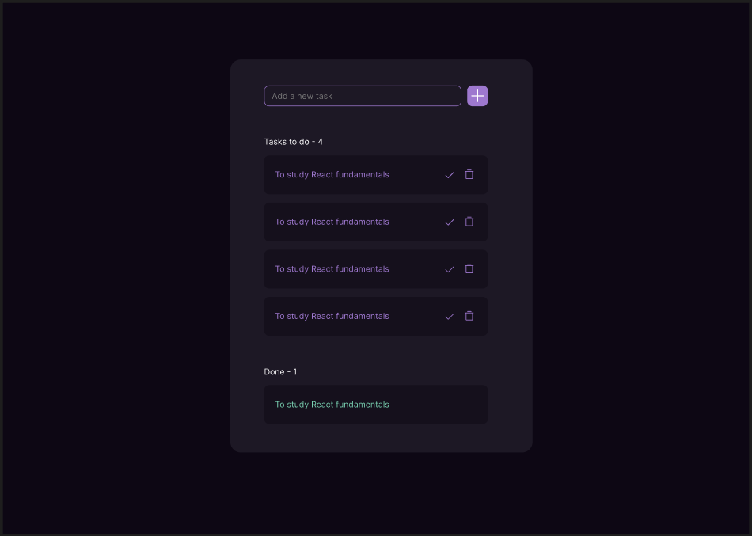

# TODO App

This is my first Vue project. The idea spawned after watching the Vue.js 3 **Fundamentals with the Composition API** course from vue school. The visual inspiration came from [this figma file](https://www.figma.com/community/file/1348652218299666548/todo-app).

Here is a screenshot of the target app that I'm recreating here:


## Recommended IDE Setup

[VSCode](https://code.visualstudio.com/) + [Volar](https://marketplace.visualstudio.com/items?itemName=Vue.volar) (and disable Vetur).

## Customize configuration

See [Vite Configuration Reference](https://vitejs.dev/config/).

## Project Setup

```sh
pnpm install
```

### Compile and Hot-Reload for Development

```sh
pnpm dev
```

### Compile and Minify for Production

```sh
pnpm build
```
